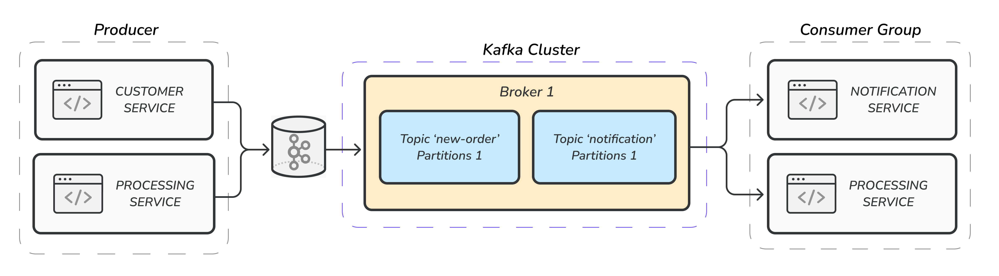

# Очередь заказов с Apache Kafka

Тестовый проект, демонстрирующий использование Apache Kafka для асинхронной обработки данных и передачи сообщений между разными компонентами приложения.

Проект имитирует работу интернет-магазина и имеет следующую архитектуру:

- **Customer Service** - отвечает за принятие заказов от клиентов, первичную валидацию данных и размещение их в очереди для обработки. 
- **Processing Service** - занимается обработкой заказов по мере их поступления от Customer Service'a.
- **Notification Service** - отправляет уведомления клиентам о статусе их заказов по мере обработки.



## Используемые технологии

      

## Инструкция по запуску

Для развертывания приложения:

```bash
  mvn clean package
```
```bash
  docker compose up
```

## Спецификация API

Проект имеет эндпоинт для принятия заказа из фронта:
```http
POST /api/v1/order/create
```

| Параметр     | Тип        | Описание               |
|:-------------|:-----------|:-----------------------|
| `customerId` | `Long`     | Header 'X-Customer-Id'   |
| `orderDto`   | `OrderDto` | Body JSON |

Пример тела запроса:
```json
{
  "customerName": "Nikita Pominov",
  "customerPhone": "+7 (999) 999-99-99",
  "customerEmail": "nikita@mail.ru",
  "items": [
    {
      "title": "Очки для душа",
      "price": "200"
    },
    {
      "title": "Шапочка для душа",
      "price": "500"
    }
  ],
  "deliveryAddress": "Санкт-Петербург, площадь Восстания, 2",
  "date": "2023-11-11 16:30"
}